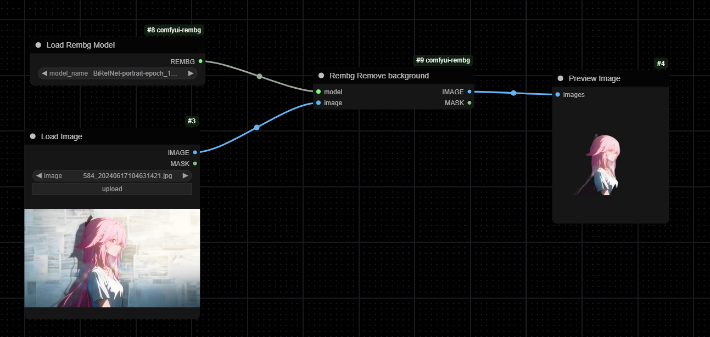

# [Rembg] Background Removal Node for [ComfyUI]

Many thanks to the author of **[rembg-comfyui-node](https://github.com/Jcd1230/rembg-comfyui-node)** for his very nice work, this is a very useful tool!

## Example



## How to use

1. Install nodes

```
git clone https://github.com/0x-jerry/comfyui-rembg.git
```

2. Download models from the [Rembg models][rembg-models] and put them in the `models/rembg` directory.

3. Use the Rembg nodes in your workflow.

[rembg]: https://github.com/danielgatis/rembg
[rembg-models]: https://github.com/danielgatis/rembg?tab=readme-ov-file#models
[comfyui]: https://github.com/comfyanonymous/ComfyUI
